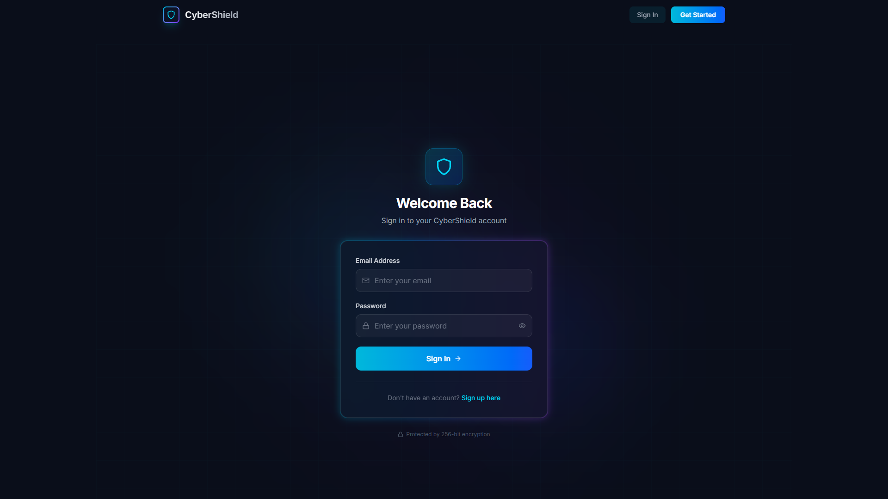

# 1. PROJECT TITLE
CyberShield – Comprehensive Cybersecurity Toolkit

# 2. SHORT DESCRIPTION
A robust cybersecurity toolkit built with a Node.js backend and React frontend for phishing detection, password analysis, AI-powered threat monitoring, and secure authentication.

# 3. FEATURES
- User authentication with JWT & OTP
- Phishing URL detection
- Password strength checking and generation
- AI-powered chatbot for cybersecurity advice
- Threat dashboard with honeypot monitoring

# 4. TECH STACK
- Node.js
- Express.js
- MongoDB
- React 18
- Tailwind CSS

# 5. PROJECT STRUCTURE
```
CyberShield/
│── backend/
│── frontend/
│── deepfake_test_face.png
│── README.md
│── TODO.md
│── package.json
│── vercel.json
```

# 6. INSTALLATION
```bash
git clone https://github.com/VAIBHAV-w1/CyberShield.git
cd CyberShield

# Backend Setup
cd backend
npm install
npm run dev

# Frontend Setup
cd ../frontend
npm install
npm run dev
```

# 7. SCREENSHOTS

### 🛡️ Main Dashboard & UI
*(Overview of the user interface and main tools)*


### 📊 Threat Monitoring Graphs & Results
*(Visual representation of monitored threats and honeypots)*



### 🔍 Phishing Detection Outputs
*(Analysis results for potentially malicious URLs)*


### 🤖 AI Cybersecurity Assistant
*(Chatbot interface providing security advice)*


### 🔐 Password Analysis
*(Password strength checking and generation tool)*


# 8. FUTURE IMPROVEMENTS
- Real-time threat intelligence feeds
- Mobile application
- Automated penetration testing tools
- Dark web monitoring integration

# 9. AUTHOR
Vaibhav S Wandkar
